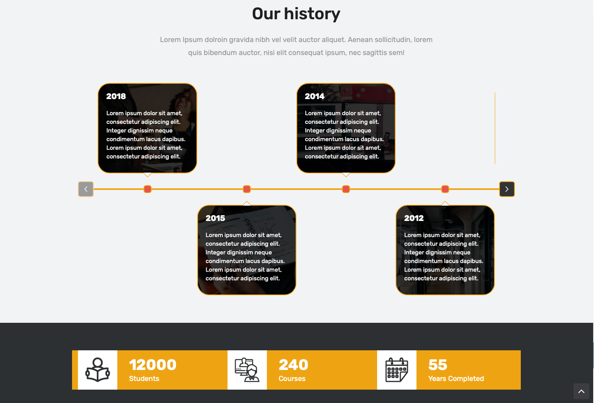
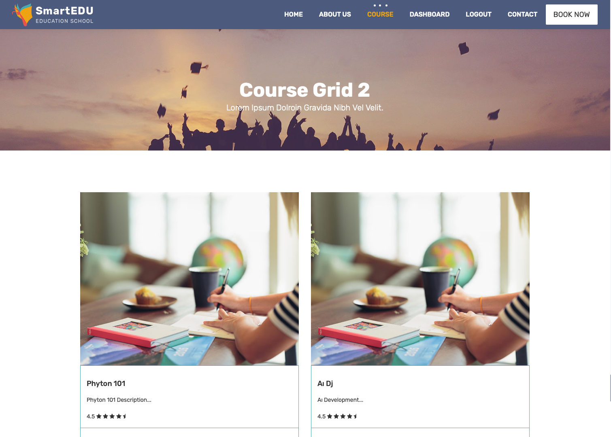
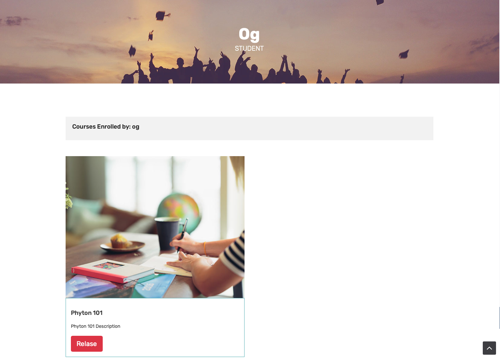
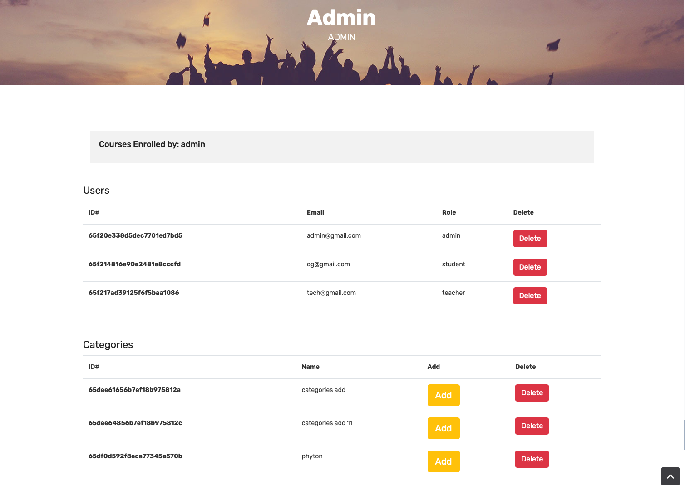

# SmartEduPro-NodeJs

# Library

> **MongoDB** > **NodeJS** > **express.js** > **bcrypt** > **connect-flash** > **connect-mongo** > **ejs** > **express-session** > **express-validator** > **method-override** > **mongoose** > **nodemailer** > **slugify**

# Getting Started

```bash
# using npm
npm install

# OR using Yarn
yarn install

# start propject
npm start
```

# Proje Açıklama

> Kullanıcı Kayıt ve Validasyon işlemleri yapıldı `Teacher and Student` olarak
> Role göre kursa kayıt ve kurs oluşturma işlemleri yapıldı
> Kullanıcı `CRUD` işlemi sırasında `Flash message` verildi
> Veri tabanı Bağlantısı oluşturuldu `MongoDB` ile
> Tüm kullanıcıların kontrol altında tutulduğu `Admin Dashboard` oluşturuldu
> Kullanıcı `mail` gönderme işlemi sağlandı `Nodemailer` ile
> `CRUD` -> Create, Read, Update, Delete
> `Flash message` -> Kısa süreli bildirim mesajı

# Project Description

> User Registration and Validation processes were performed for `Teacher and Student` roles
> Course registration and creation operations were performed according to the user role.
> `Flash message` were displayed during the user `CRUD` operation
> Database connection was established with `MongoDB`.
> `Admin Dashboard` was created to keep track of all users.
> User `email` sending was provided with `Nodemailer`.
> `CRUD` -> Create, Read, Update, Delete

<div>













</div>
